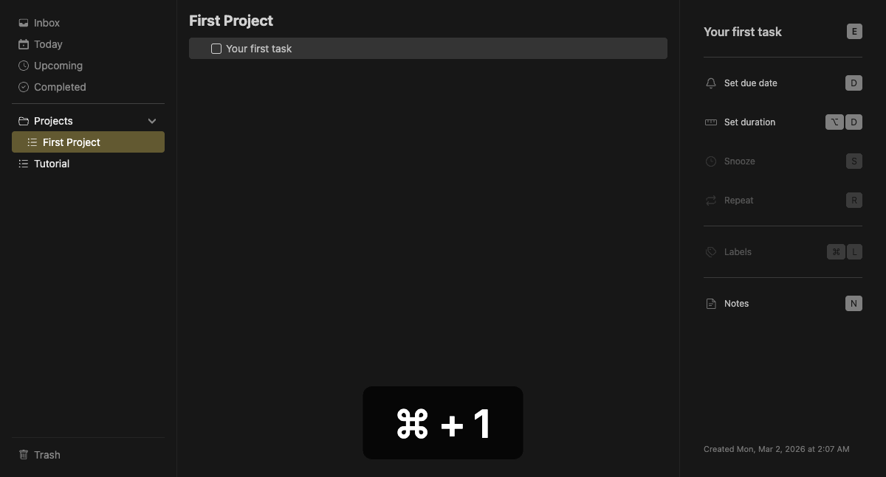
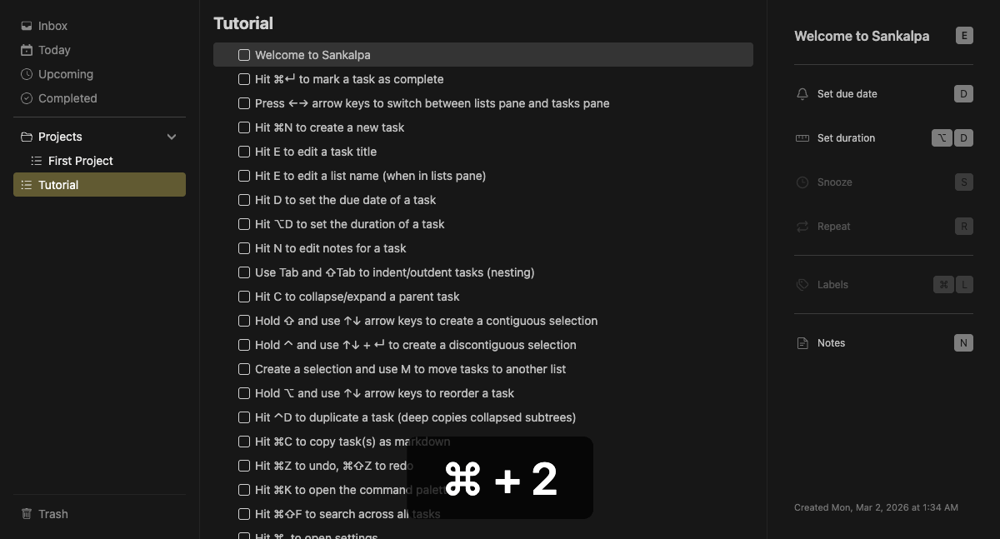
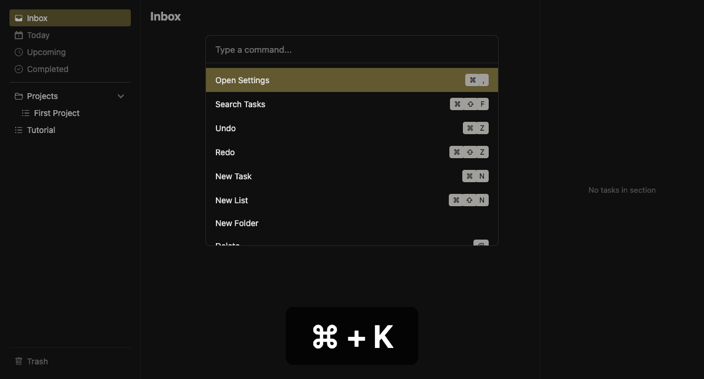
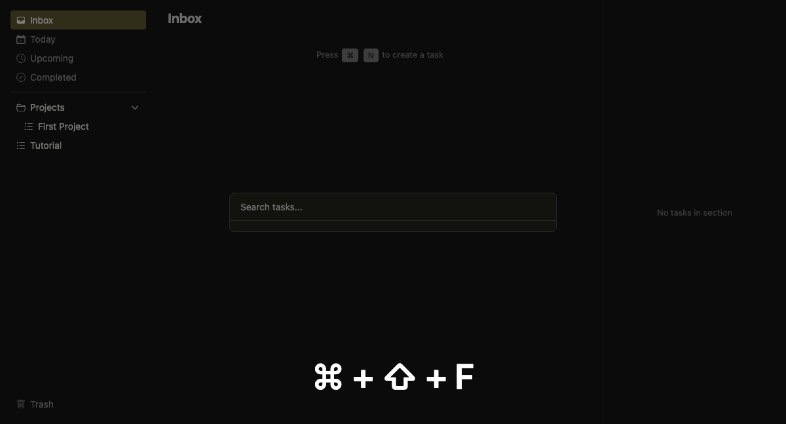

<p align="center">
  
</p>

<p align="center"><em>Sankalpa</em> (Sanskrit): intention — a conscious decision to act.</p>

<p align="center">A keyboard-first task manager for macOS. Fast, local, focused.</p>

---

## Why

Speed protects flow. When a thought appears, you capture it instantly — no context switch, no mouse reach, no UI negotiation.

The Inbox holds intentions as they arise, so your mind doesn't have to. Clear your headspace for the task at hand, not for remembering what comes next.

## Features

| Feature | Description | Docs |
|---------|-------------|:----:|
| **Keyboard-first** | 100% keyboard driven — your hands never leave the keys | [Keybindings](#keybindings) |
| **Three-pane layout** | <details><summary>Lists, tasks, and detail pane for notes and metadata</summary><br></details> | [Docs](docs/features/navigation.md) |
| **Smart Lists** | Inbox, Today, Overdue, Upcoming, Completed, Trash — dynamically generated views | [Docs](docs/features/smart-lists.md) |
| **Create task** | <details><summary>Instantly add tasks with `⌘N`, inline editing</summary><br></details> | [Docs](docs/features/create-task.md) |
| **Edit task** | <details><summary>Rename tasks in place with `E`</summary><br></details> | [Docs](docs/features/edit-task.md) |
| **Complete task** | <details><summary>Complete tasks with `⌘↵` and visual feedback</summary><br></details> | [Docs](docs/features/complete-task.md) |
| **Create list** | <details><summary>Create folders and custom lists with `⌘⇧N`</summary><br></details> | [Docs](docs/features/create-list.md) |
| **Edit list** | <details><summary>Rename lists with `E`</summary><br></details> | [Docs](docs/features/edit-list.md) |
| **Subtask nesting** | <details><summary>Nest tasks with `Tab` / `⇧Tab`</summary><br></details> | [Docs](docs/features/subtask-nesting.md) |
| **Collapse/Expand** | <details><summary>Focus on what matters — toggle subtrees with `C`</summary><br></details> | [Docs](docs/features/collapse.md) |
| **Multi-select** | <details><summary>Batch operations on multiple tasks with `⇧↑↓` and `⌃⇧↵`</summary><br></details> | [Docs](docs/features/multi-select.md) |
| **Move task** | <details><summary>Reorganize tasks between lists with `M`</summary><br></details> | [Docs](docs/features/move-task.md) |
| **Reorder** | <details><summary>Drag-free reordering with `⌥↑↓`</summary><br></details> | [Docs](docs/features/reorder.md) |
| **Due dates** | <details><summary>Natural language input — "tmrw", "next friday", "dec 25"</summary><br></details> | [Docs](docs/features/due-dates.md) |
| **Duration** | <details><summary>Time estimates with quick presets (15m, 30m, 1h, 2h)</summary><br></details> | [Docs](docs/features/duration.md) |
| **Task notes** | <details><summary>Rich markdown notes with live preview</summary><br></details> | [Docs](docs/features/notes.md) |
| **Command palette** | <details><summary>Fuzzy search all commands with `⌘K`</summary><br></details> | [Docs](docs/features/command-palette.md) |
| **Global search** | <details><summary>Find any task instantly with `⌘⇧F`</summary><br></details> | [Docs](docs/features/search.md) |
| **Undo/Redo** | <details><summary>Full operation history with `⌘Z` / `⌘⇧Z`</summary><br></details> | [Docs](docs/features/undo-redo.md) |
| **Clipboard** | <details><summary>Copy tasks as markdown, paste to create</summary><br></details> | [Docs](docs/features/clipboard.md) |
| **Duplicate** | <details><summary>Deep copy tasks and entire subtrees with `⌃D`</summary><br></details> | [Docs](docs/features/duplicate.md) |
| **Global hotkeys** | <details><summary>Quick capture from any app with `⌘⌥⇧Space`</summary><br></details> | [Docs](docs/features/global-hotkeys.md) |
| **Hardcore mode** | <details><summary>Disable mouse completely for pure keyboard flow</summary><br></details> | [Docs](docs/features/settings.md) |
| **Local-first** | SQLite database — your data stays on your machine | |

## Stack

Electron · React · TypeScript · Vite · sql.js (SQLite via WASM)

## Keybindings

| Key | Action |
|-----|--------|
| `↑` `↓` | Navigate items |
| `←` `→` | Switch panes / collapse-expand |
| `E` | Edit selected item |
| `Tab` | Indent task |
| `⇧Tab` | Outdent task |
| `⌥↑` `⌥↓` | Reorder item |
| `Delete` | Delete selected |
| `Esc` | Cancel / close |

| Key | Action |
|-----|--------|
| `⌘N` | New task |
| `⌘⇧N` | New list |
| `⌘↵` | Complete task |
| `⌘Z` | Undo |
| `⌘⇧Z` | Redo |
| `⌘K` | Command palette |
| `⌘⇧F` | Global search |
| `⌘,` | Settings |

| Key | Action |
|-----|--------|
| `M` | Move task to list |
| `D` | Set due date |
| `⌥D` | Set duration |
| `N` | Open notes |
| `C` | Collapse/expand |
| `F` | Cycle filters |

### Multi-select

| Key | Action |
|-----|--------|
| `⇧↑` `⇧↓` | Extend selection |
| `⌃↑` `⌃↓` | Move cursor |
| `⌃↵` | Toggle at cursor |
| `Space` | Clear selection |

### Global Hotkeys

| Key | Action |
|-----|--------|
| `⌘⌥⌃Space` | Toggle window |
| `⌘⌥⇧Space` | Quick add to Inbox |

## Quick Start

```bash
npm install
npm run dev
```

See [DEVELOPING.md](DEVELOPING.md) for full setup instructions.

## Testing

```bash
npm test                    # Unit tests
npm run test:e2e            # E2E tests (visible window)
npm run test:e2e:headless   # E2E tests (headless)
```

## Architecture

See [`docs/`](docs/) for details:

- [Architecture overview](docs/architecture.md)
- [Architecture Decision Records](docs/adr/)
- [Electron IPC](docs/electron-ipc.md)
