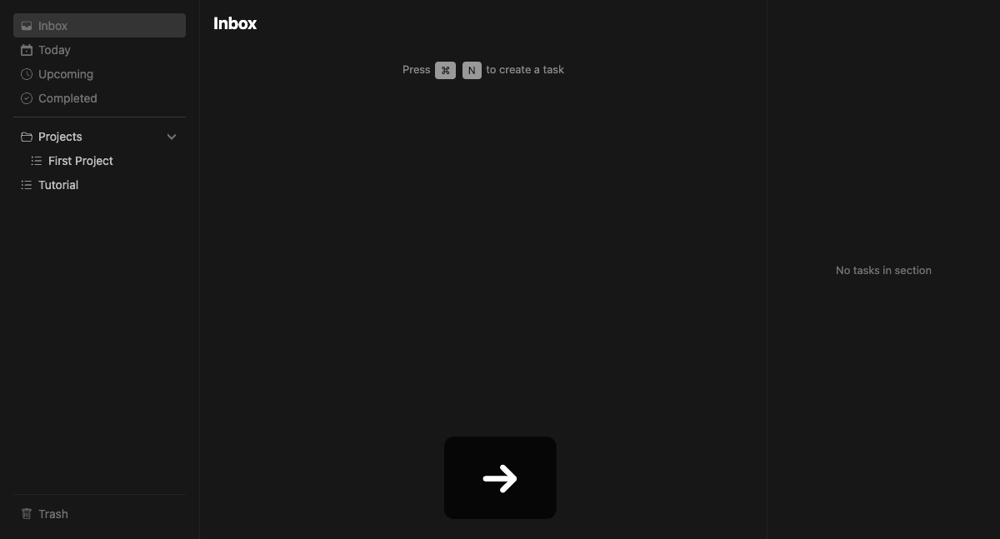

# Cloud Sync

Sync your local database to Supabase for cross-device backup and restore.



## Setup

See [Cloud Sync Setup Guide](../cloud-sync-setup.md) for Supabase project creation and credential configuration.

## Settings UI

Open **Settings** (`Cmd+,`) → **Cloud Sync** to configure and manage cloud sync.

### Connecting

1. Enter your Supabase URL and Service Role Key
2. Press **Save & Connect** (or `Enter`)
3. A green dot confirms the connection

### Connected State

Once connected, three actions are available:

| Action | Description |
|--------|-------------|
| **Sync to Cloud** | Pushes local database to cloud, creating a GFS backup snapshot first |
| **Restore from Cloud** | Opens restore menu — restore latest cloud state or a previous backup |
| **Disconnect** | Removes stored credentials |

### Restore from Cloud

The restore menu shows two sections:

- **Restore Latest** — replaces local database with current cloud data
- **Restore from Backup** — browse GFS snapshots by date and tier (daily/weekly/monthly)

Use `↑↓` to select, `Enter` to confirm, `Esc` to go back. A confirmation prompt appears before any restore.

## GFS Backup System

Every sync automatically creates a snapshot of your local data before uploading. Snapshots follow a Grandfather-Father-Son rotation:

| Tier | Retention |
|------|-----------|
| Daily | 7 snapshots |
| Weekly | 4 snapshots (created on Sundays) |
| Monthly | 3 snapshots (created on 1st of month) |

Older snapshots beyond these limits are automatically pruned.

## Keyboard Navigation

| Key | Action |
|-----|--------|
| `↑` `↓` | Navigate categories / buttons / snapshots |
| `Tab` | Cycle input fields (URL → Key → Save) |
| `Enter` | Execute focused action / confirm restore |
| `Esc` | Cancel / go back / close settings |

## Hot Reload

After a cloud restore, the database file is replaced on disk. The app watches for file changes and automatically reloads the database — no restart required. `Cmd+R` also triggers a manual reload.

## CLI Scripts

For manual operations outside the app:

```bash
npm run sync:cloud       # Push local data to cloud
npm run restore:cloud    # Pull cloud data to local
npm run nuke:cloud       # Delete all cloud data
```

These scripts read credentials from `.env.cloud-sync`.
