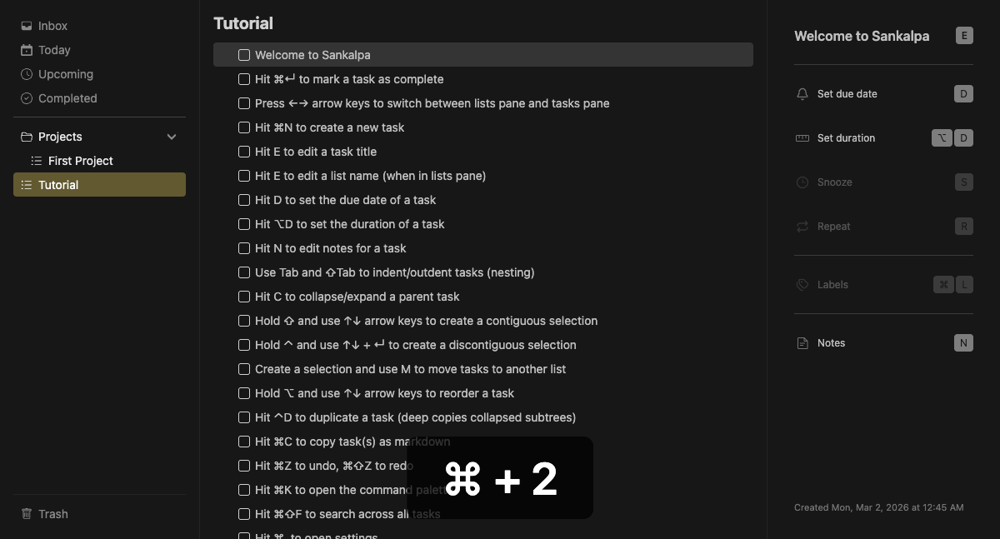

# Complete Task

Mark tasks as done.

## Keybinding

| Key | Action |
|-----|--------|
| `Cmd+Enter` | Toggle task completion |

## Behavior

- Completed tasks show strikethrough text
- Completing a parent prompts to complete all subtasks
- Completed tasks appear in the Completed smart list
