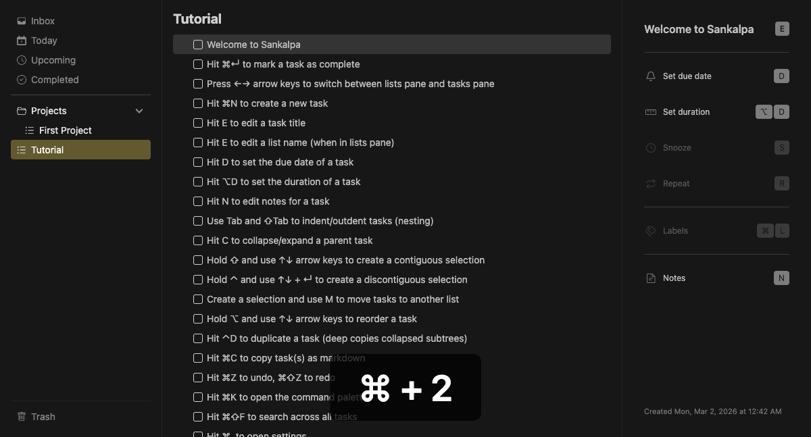

# Edit Task

Modify task titles.

## Keybinding

| Key | Action |
|-----|--------|
| `E` | Edit selected task |

## Behavior

- Opens inline editor with current title
- Press `Enter` to save, `Escape` to cancel
