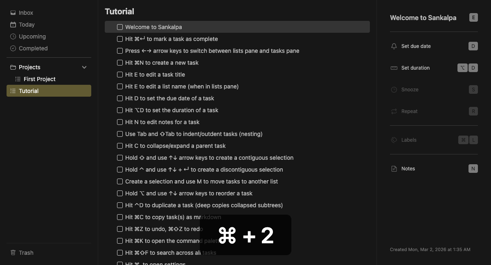

# Multi-select

Select multiple tasks for batch operations.



## Keybindings

| Key | Action |
|-----|--------|
| `Shift+↑/↓` | Extend/contract contiguous selection |
| `Ctrl+↑/↓` | Move cursor without changing selection |
| `Ctrl+Enter` | Toggle selection at cursor (discontiguous) |
| `Space` | Clear selection |

## Selection Types

### Contiguous Selection

Hold Shift and use arrow keys to select adjacent tasks.

```
☐ Task A
☐ Task B  ← selection start
☐ Task C  ← selected
☐ Task D  ← selection end (cursor)
☐ Task E
```

### Discontiguous Selection

Use Ctrl+Arrow to move cursor, Ctrl+Enter to toggle selection.

```
☐ Task A
☐ Task B  ← selected
☐ Task C
☐ Task D  ← selected
☐ Task E  ← cursor (not selected)
```

## Batch Operations

Operations that work with multi-select:

- **Delete** (Delete/Backspace) — Move all selected to Trash
- **Move** (M) — Move all selected to another list
- **Copy** (Cmd+C) — Copy all selected as markdown
- **Complete** (Cmd+Enter) — Mark all selected complete
