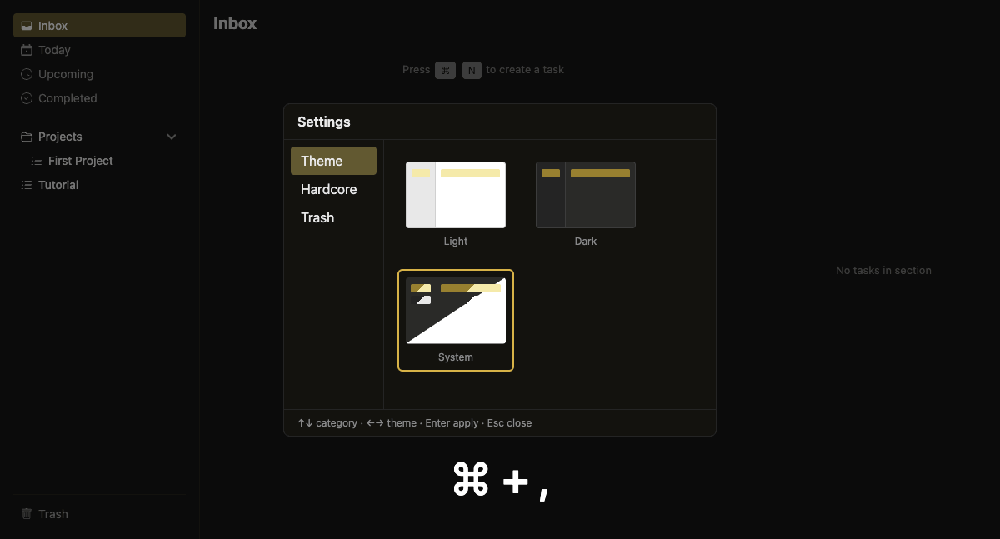

# Settings

Configure app behavior.

## Keybinding

| Key | Action |
|-----|--------|
| `Cmd+,` | Open settings |

## Categories

The settings modal has a side panel with four categories:

### Theme

Choose between Light, Dark, or System theme. Use `←→` to cycle, `Enter` to apply.

### Hardcore Mode

Disables mouse interaction for pure keyboard flow.

- Default: OFF
- When enabled, clicking has no effect
- All navigation must use keyboard

### Trash

Configure automatic trash purge retention: 7, 14, 30, 90 days, or Never. Use `←→` to cycle, `Enter` to apply.

### Cloud Sync

Connect to Supabase for cloud backup and restore. See [Cloud Sync](cloud-sync.md) for full details.

## Keyboard Navigation

| Key | Action |
|-----|--------|
| `↑` `↓` | Navigate categories |
| `←` `→` | Cycle options (theme, retention) |
| `Enter` / `Space` | Apply selection / toggle |
| `Tab` | Cycle fields (Cloud Sync) |
| `Esc` | Close settings |
