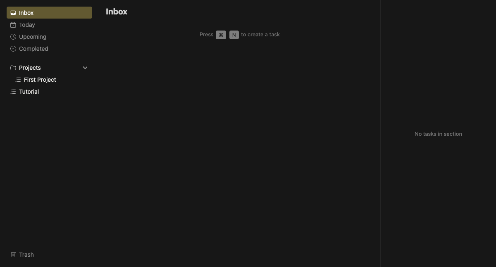

# Smart Lists

Built-in lists that automatically filter tasks based on criteria.

## Lists

| List | Filter | Badge |
|------|--------|-------|
| Inbox | Tasks with no list assigned (`list_id = null`) | Task count |
| Today | Tasks due today | Task count |
| Overdue | Tasks past due date | Red badge with count |
| Upcoming | Tasks due in the future | Task count |
| Completed | Completed tasks across all lists | Task count |
| Trash | Soft-deleted tasks | Task count |

## Behavior

- Smart lists appear at the top of the lists pane
- Cannot be renamed, deleted, or reordered
- Tasks in Today/Overdue/Upcoming show their source list name
- Overdue list is hidden when empty (skipped during navigation)

## Badges

- Standard badge: black background with white count
- Overdue badge: red background indicating urgency
- Today list shows both overdue (red) and today (black) counts when applicable
